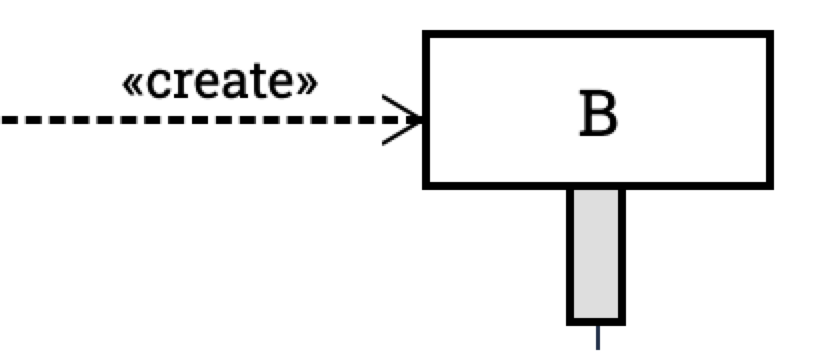
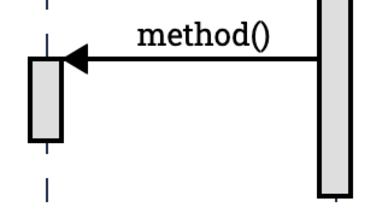

= The two layer structure

At the highest level, the diagram is rendered in two layers:
the lifeline layer and the message layer.

....

    

    

    

    

....

== Key classes
=== .absolute
The `absolute` class is used to remove the lifeline layer from the normal
flow of the document.

=== .h-full
The `h-full` class is used to make the lifeline layer as tall as the parent
element. The parent element get the height from the `message-layer`.

== The message layer

=== Message arrow
.Message arrow (the dashed line and arrow head)

This time we focus on how to align the arrow line and the arrow head.
We use a similar approach as pattern #vertically aligning# with pattern
#shift half the height#. Instead of `items-center` we use `items-end`.
Then we use `translate-y-1/2` to shift the arrow head down half the
height of the arrow head. (See Message.vue)
....
  
{{content}}

    <point class="flex-shrink-0 transform translate-y-1/2 -my-px" :fill="fill" :rtl="rtl"/>
  

....

==== Key classes
===== .flex .items-end
The `flex` and `items-end` classes are used to align the arrow line
and the arrow head at the bottom of the message.

===== .flex-grow
The `flex-grow` class is used to make the message name grow to fill
the available space.

===== .flex-shrink-0
The `flex-shrink-0` class is used to make the arrow head not shrink
when the message name is too long.

===== .transform .translate-y-1/2
The `transform` and `translate-y-1/2` classes are used to shift the
arrow head down half the height of the arrow head.

=== Message arrow right to left

....
  
{{content}}

    <point class="flex-shrink-0 transform translate-y-1/2 -my-px"/>
  

....

==== Key classes
===== .order-last
The `order-last` class is used to move the message name to the right
of the arrow head.

=== Creation

==== Pattern 1: Vertically aligning

....

  

  

....

==== Pattern 2: Shift half the height

The message arrow is supposed to point to the middle of the participant
box. It is not he whole message that is aligned with the participant
box. So we have to shift the message up half the height of the message.
....

  

  

....

This pattern is also used at the arrows. See the image for creation.

